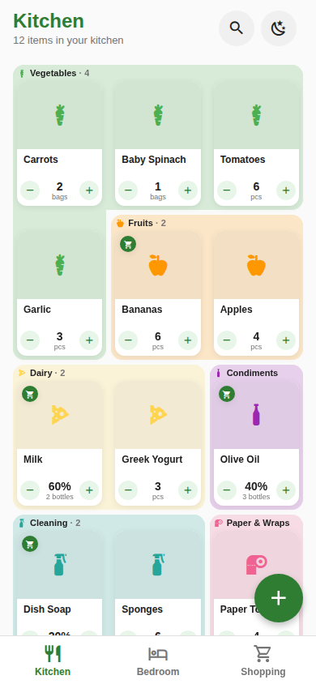
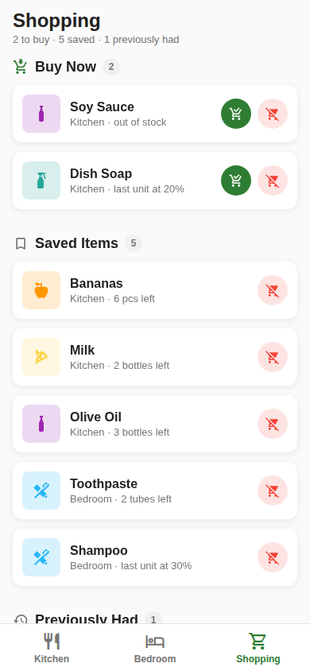
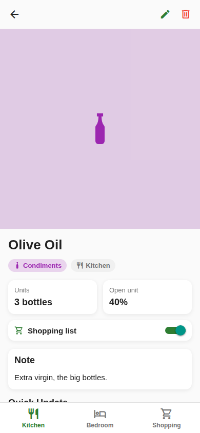
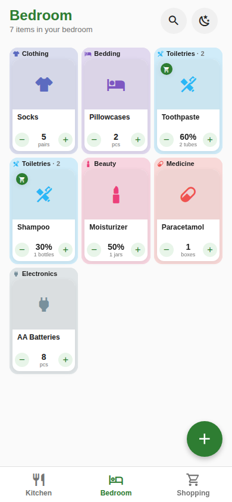
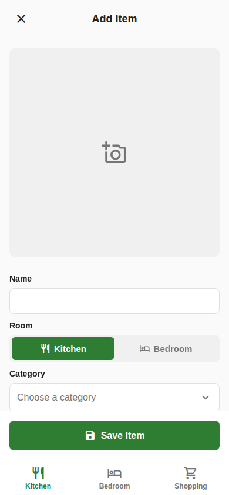
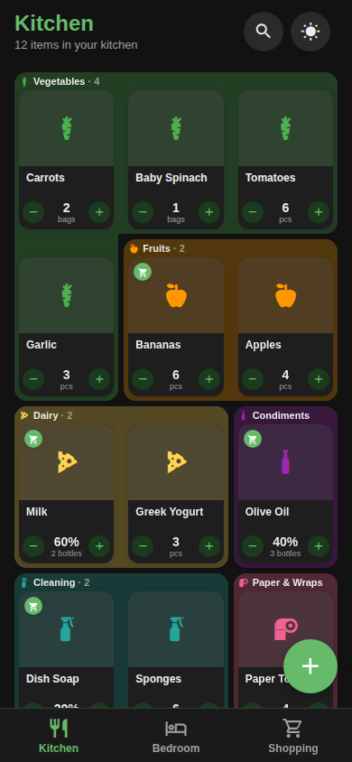

# xrnhome

A simple home inventory app for your phone. Add the things you keep in your
kitchen and bedroom, tap a button when you use some, and let the app tell you what
needs restocking.

Everything lives on your device. There is no account, no server, and nothing
leaves your phone.

| Kitchen | Shopping | Item detail |
| :--: | :--: | :--: |
|  |  |  |

| Bedroom | Adding an item | Dark mode |
| :--: | :--: | :--: |
|  |  |  |

## Features

- **Track what you have** — every item gets a photo, a room, a category, a count
  and an optional note.
- **Kitchen and Bedroom** — each room has its own tab and its own categories. The
  kitchen covers food as well as cleaning supplies, paper and wraps, and
  kitchenware.
- **Count part-used items** — for things like a bottle of oil, track how much of
  the open one is left instead of pretending it is full or empty.
- **Shopping list** — flag items you always re-buy and they show up under
  "Buy Now" as soon as they run low, whichever room they belong to.
- **Nothing gets lost** — items you finish move to a "Previously Had" list, so you
  can put them back on the shopping list or delete them for good.
- **Quick to browse** — items sit three to a row. Each category sits on a patch
  of its own color with its name on it, so a row can hold the end of one
  category and the start of the next. Search hides behind a button until you
  need it.
- **Light and dark** — follows your system theme.

## Requirements

- [Node.js](https://nodejs.org/) 18 or newer
- The [Expo Go](https://expo.dev/go) app on your phone, for development

## Getting started

```bash
git clone https://github.com/Xernnn/xrnhome
cd xrnhome
npm install
npm start
```

Scan the QR code with Expo Go, or press `a` / `i` in the terminal to open an
Android or iOS simulator. There are no custom native modules, so Expo Go is
enough for day-to-day development.

Your computer and phone need to be on the same network. If the QR code will not
connect, a tunnel usually gets around it:

```bash
npx expo start --tunnel
```

## Installing it on your phone

To get a real app you can keep, build an APK with
[EAS](https://docs.expo.dev/build/introduction/):

```bash
npm install -g eas-cli
eas login
eas build --profile preview --platform android
```

The build runs in the cloud and finishes with a download link. Open it on your
phone and install. That copy runs on its own with no computer attached, and its
data is separate from anything you added in Expo Go.

## How the counting works

Each item has a single count of units, and that count includes the one you have
already opened. Three bottles where the open one is 40% full is *3 bottles, open
one at 40%*.

Pressing minus takes a bite out of the open unit. When it is used up, the count
drops by one and the next unit opens. For items where a part-used count makes no
sense — eggs, cans, packets — turn "Track in %" off and minus just removes a
whole unit.

An item counted in % stays that way. When its last unit runs out it keeps
counting in %, and the next one you buy starts at 100%.

## Project structure

```
App.js                  navigation, tabs and providers
src/
  screens/              room (Kitchen, Bedroom), Shopping, Add, Edit, Item detail
  components/           item cards, category grid, search bar, pickers, badges
  context/              inventory state and theme
  utils/                rooms, categories, units, styling tokens, local storage
assets/                 app icon and splash image
```

## Built with

React Native, [Expo](https://expo.dev/) (SDK 54),
[React Navigation](https://reactnavigation.org/) and
[AsyncStorage](https://react-native-async-storage.github.io/async-storage/) for
local persistence.
