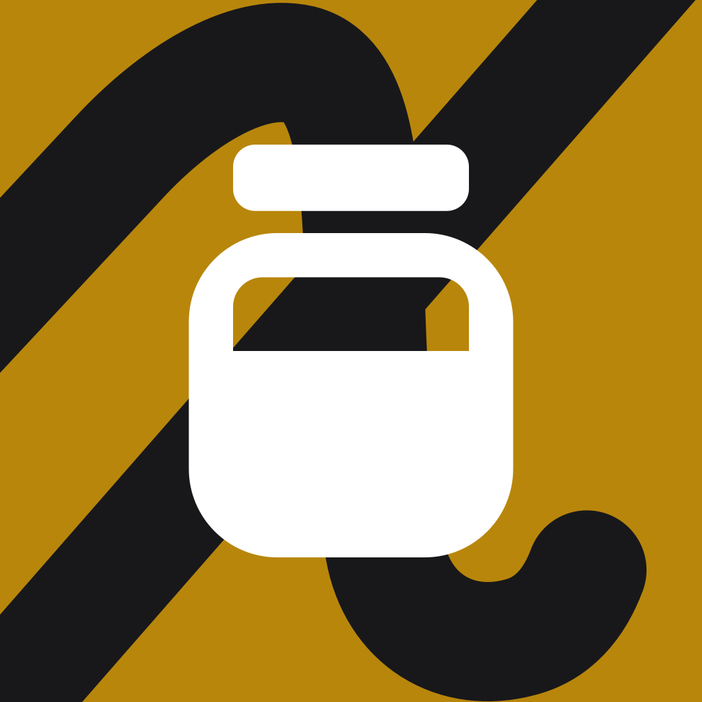
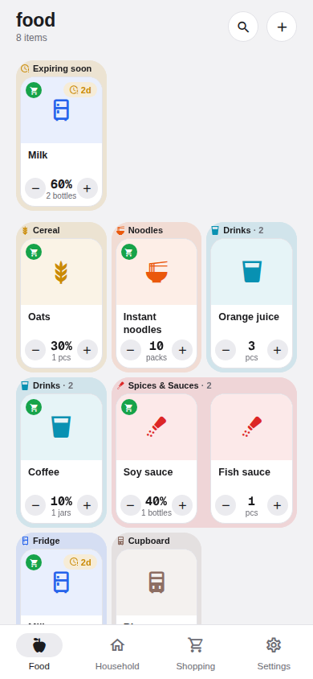
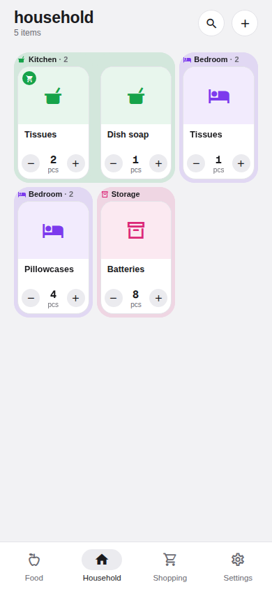
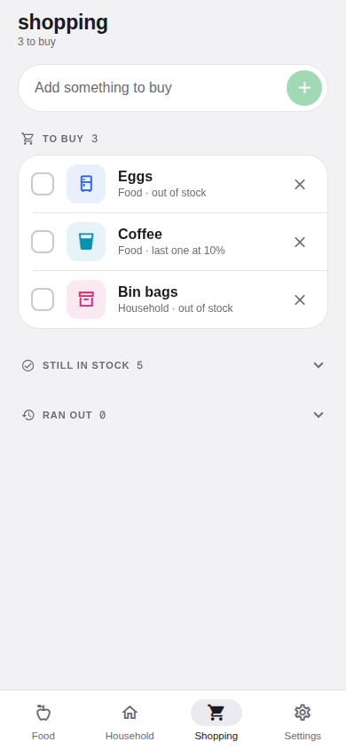
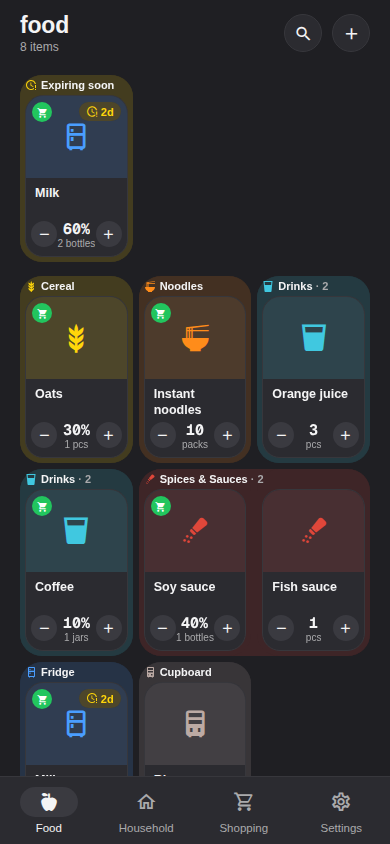
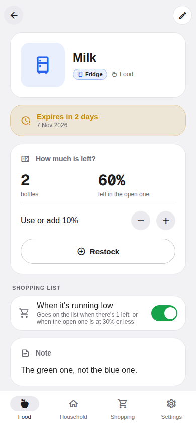
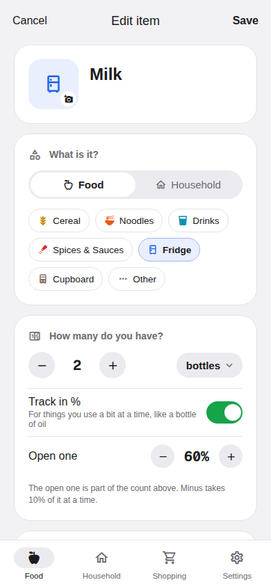
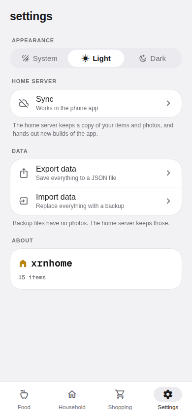
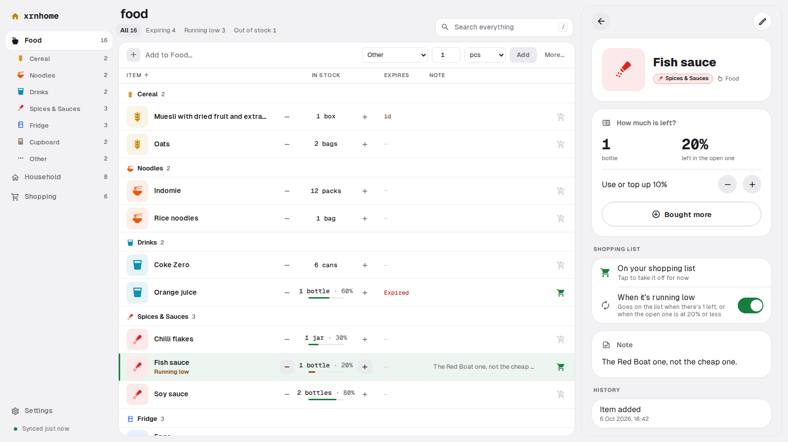

<p align="center">
  
</p>

<h1 align="center">xrnhome</h1>

A simple home inventory app for your phone. Add the food you keep and the things
you own, tap a button when you use some, and let the app tell you what needs
restocking.

Everything lives on your phone. There is no account and no cloud. If you run
a small server at home, the app can keep a copy of your items and photos there
and update itself from it. Your data goes nowhere else.

| Food | Household | Shopping | Dark mode |
| :--: | :--: | :--: | :--: |
|  |  |  |  |

| An item | Editing an item | Settings |
| :--: | :--: | :--: |
|  |  |  |

## Features

- **Track what you have** — every item gets a name, and if you like a photo, a
  category, a count and a note. Counts can be typed as well as tapped, and units
  run from packs and bottles to kg and ml.
- **Food and Household** — each type has its own tab and its own categories.
  Food is anything you eat or drink: cereal, noodles, drinks, spices and sauces,
  and what's in the fridge or the cupboard. Household is the physical things you
  own, sorted by where they live: kitchen, bedroom or storage. Add your own
  categories when those aren't enough.
- **Count part-used items** — for things like a bottle of oil, track how much of
  the open one is left instead of pretending it is full or empty.
- **Expiry dates** — give an item an optional expiry date. Anything expired or
  due within four days is flagged on its card and counted in a banner at the top
  of its tab, and a notification tells you four days ahead and on the day. When
  you buy more of something that had a date, the app asks for the new one.
- **Shopping list** — type anything you need into the box on the Shopping tab,
  or flag items you always re-buy so they land under "To buy" when they run
  low, whichever tab they belong to. You choose what "low" means for each item:
  down to so many left, the open one down to some %, or either one. Stock that
  has expired counts as needing replacing too. The list is grouped by category
  and can be shared. In the shop, tick things off as you go: ticked items stay in
  "In the cart", even if the app is closed, where you can set how many you bought
  or untick a mistake.
- **Nothing gets lost** — things you finish that aren't on the list wait under
  "Ran out", one tap from going back on it. Deleting, finishing a unit and taking
  something off the list all show an undo button for a few seconds, and a form
  with unsaved changes asks before it closes.
- **Quick to browse** — items sit three to a row on a panel in their category's
  colour, and a card only spends room on a photo if there is one. Search looks
  through both tabs, including things that have run out.
- **Light and dark** — soft greys rather than stark white or black, in the same
  look as the other xrn apps. Follows your system theme, or pick one in
  Settings.
- **Your own home server** — connect the app to the small server in
  [`server/`](server) and it keeps a copy of every item and photo there, sent a
  few seconds after each change. A new phone, or the same phone after a
  reinstall, restores everything from it. The server also hands out new builds
  of the app: they download on Wi-Fi, and install after asking.
- **Cards in the colour of the pack** — each item's card takes its colour from
  its photo, so the page looks like your own shelves. Anything counted in % shows
  what's left as a line across the photo.
- **The same app on your laptop** — the server also serves the app as a web page,
  laid out for a big screen: the same cards in a wider grid, the shopping list
  always beside them, and a box to add things by typing a name and pressing Enter.
  Open it in a browser and sign in, and it stays in step with the phone: changes on
  either side show up on the other while the app is open, and the two are merged
  rather than one replacing the other.
- **Backup and restore** — export everything to a JSON file from Settings, and
  import it again on the same phone or a new one. Backup files don't include
  photos. The home server does.
- **Photos that stick** — pictures are shrunk to a sensible size and copied into
  the app's own storage, so they survive the system clearing its photo picker
  cache.
- **Careful with your data** — if the saved list is ever damaged, the app recovers
  what it can and keeps the damaged copy instead of starting empty. It won't send
  an empty or recovered list over the home server's copy without asking, and a
  restore either brings back everything, photos included, or changes nothing.

## Requirements

- [Node.js](https://nodejs.org/) 18 or newer
- The [Expo Go](https://expo.dev/go) app on your phone, for development

## Getting started

```bash
git clone https://github.com/Xernnn/xrnhome
cd xrnhome
npm install
npm start
```

Scan the QR code with Expo Go, or press `a` / `i` in the terminal to open an
Android or iOS simulator. There are no custom native modules, so Expo Go is
enough for day-to-day development.

The rules behind the app (counting, the shopping list, merging, recovery, the
sync's safety checks and the colour contrast) have tests:

```bash
npm test
```

Your computer and phone need to be on the same network. If the QR code will not
connect, a tunnel usually gets around it:

```bash
npx expo start --tunnel
```

## Installing it on your phone

To get a real app you can keep, build an APK with
[EAS](https://docs.expo.dev/build/introduction/):

```bash
npm install -g eas-cli
eas login
eas build --profile preview --platform android
```

The build runs in the cloud and finishes with a download link. Open it on your
phone and install. That copy runs on its own with no computer attached, and its
data is separate from anything you added in Expo Go.

### Updates from your home server

Once the app is connected to a home server (below), new builds can come from
there instead:

```bash
node scripts/release.mjs
```

This builds the release APK on your computer and uploads it to the server over
ssh, with an `app.json` that names it. It bumps `android.versionCode` in
`app.json` first if the server already has that build. The app checks every
few hours, or right away from Settings → Check for updates. It downloads the
APK and opens Android's installer. The script reads
`~/.config/xrnhome/release.json`:

```json
{ "server": "https://<your-host>/xrnhome", "ssh": ["<ssh-host>"] }
```

The local build needs the Android SDK, NDK 27.1 and JDK 17. Android only
installs an update signed with the same key as the app already on the phone.

## Your home server

[`server/xrnhome-sync.py`](server/xrnhome-sync.py) is a single Python file with
no dependencies besides `bcrypt`. It stores one copy of your items per user,
plus their photos, and checks logins against an htpasswd file with bcrypt hashes
(Radicale's works as it is):

```bash
pip install bcrypt
python3 server/xrnhome-sync.py --data ~/xrnhome-sync/data --users ~/.config/xrn-sync/users
```

It listens on `127.0.0.1:5236`. Publish it over HTTPS under `/xrnhome` with a
reverse proxy such as Tailscale Funnel or Caddy. Then, in the app, go to Settings
→ Home server and enter `https://<your-host>/xrnhome` with your user name and
password.

Each device sends all of its items after a change, and the server only accepts a
write made on top of the copy that device last saw. A device that finds the
server has moved on fetches what's there and merges it into its own items:

- What only one side changed is kept, and the later edit wins where both changed
  the same thing.
- Stock counts add up. If one side used a can while the other bought three, that's
  two more than there were.
- A deletion only wins over an item nobody has touched since. An edit brings the
  item back, because putting back something deleted is easy and getting back
  something lost isn't.

A phone that never synced can't overwrite what's there. It asks whether to keep
everything from both, restore the server's copy, or replace it with its own. A
device that has lost its items, or had to recover a damaged list, asks before
sending anything, and so does one whose merge would remove most of its items. Every
write also keeps the copy it replaced: the last 20 in `history/`, and the first one
of each day for 60 days in `daily/`.

```bash
python3 -m unittest server/test_xrnhome_sync.py    # needs bcrypt
```

### The laptop version

```bash
node scripts/release.mjs --web     # build the web version and put it on the server
```

Then open `https://<your-host>/xrnhome/` in a browser. It asks for the same login
as the phone, and the browser keeps it, so no password is stored by the app.

It holds the same items under the same rules, with a few differences. Photos are
chosen from your files and go straight to the server, so adding one needs a
connection. There's no camera, reminders or backup files, since the server keeps the
copies. It keeps a list of its own in the browser and merges it with the server's the
same way the phone does.



In a window at least 1000 pixels wide, the shopping list stays open beside your items
as a basket, and clicking a card opens that item in its place. Point at a card for a
cart button that puts it on the list. The box at the top adds things: type a name and
press Enter, and the cursor stays there for the next one. A name you already have adds
to that item instead of making a second one. **More…** opens the full form, for a
photo or an expiry date. In a narrower window you get the phone's layout.

| Key | What it does |
| --- | --- |
| `/` | Go to the box that adds things |
| `Esc` | Close the item beside the cards |

## How the counting works

Each item has a single count of units, and that count includes the one you have
already opened. Three bottles where the open one is 40% full is *3 bottles, open
one at 40%*.

Pressing minus takes a bite out of the open unit. When it is used up, the count
drops by one and the next unit opens. For items where a part-used count makes no
sense — eggs, cans, packets — turn "Track in %" off and minus just removes a
whole unit.

An item counted in % stays that way. When its last unit runs out it keeps
counting in %, and the next one you buy starts at 100%.

When an item runs out, its expiry date is cleared too, since the date belonged
to the stock that is gone. The app remembers that the item has one and asks for
the new date when you buy more. Adding more of something you still have keeps the
earlier of the two dates.

On a card, minus and plus move the open unit by 10% for an item counted in %.
Hold plus to add a whole new one. The item's page has "Bought more" for any
amount.

### When something goes on the shopping list

Turn on "When it's running low" for things you always buy again, then say how
low. "With this many left" counts the open one too. For an item counted in %, you
can also look at the open one, say at 20%, and choose whether it goes on the list
when both are true or when either is. Running out always puts it on the list. An
item you haven't set this for goes on when it runs out, or, if it's counted in %,
when the last one is down to 20%.

With "either", buying more takes the item off the list even though the open one
is still low: that one has been dealt with. The next open one counts again.

The X on the list takes something off for this trip, and it comes back the next
time it's low after you've bought more. To stop an item coming back at all, turn
"When it's running low" off on its page.

## Project structure

```
App.js                  navigation, tabs, providers and fonts
src/
  screens/              Food and Household tabs, Shopping, Settings, Home
                        server, Your categories, Add, Edit, Item detail, and
                        the page for unreadable data
  components/           the shared building blocks (ui.js), the item form,
                        item cards, category grid, stepper, toast, badges
  desktop/              the page the laptop version puts round the app's screens
  context/              inventory state, theme, reminders, home server sync
                        and updates
  utils/                the inventory rules (inventoryLogic.js), types,
                        categories, units, expiry, restock rules, styling
                        tokens, storage, backups, photos, reminders, haptics,
                        home server requests, sync and updates
test/                   tests for the rules above
assets/                 app icon, splash image and the Geist Mono font
public/fonts/           Geist, the laptop version's text font
server/                 the home server and its tests
scripts/release.mjs     builds the APK or the laptop version and publishes it to
                        the home server
```

## Built with

React Native, [Expo](https://expo.dev/) (SDK 54),
[React Navigation](https://reactnavigation.org/) and
[AsyncStorage](https://react-native-async-storage.github.io/async-storage/) for
local persistence. Numbers are set in [Geist Mono](https://github.com/vercel/geist-font),
under the SIL Open Font License ([`assets/fonts/GeistMono-OFL.txt`](assets/fonts/GeistMono-OFL.txt)).

## License

[MIT](LICENSE)
